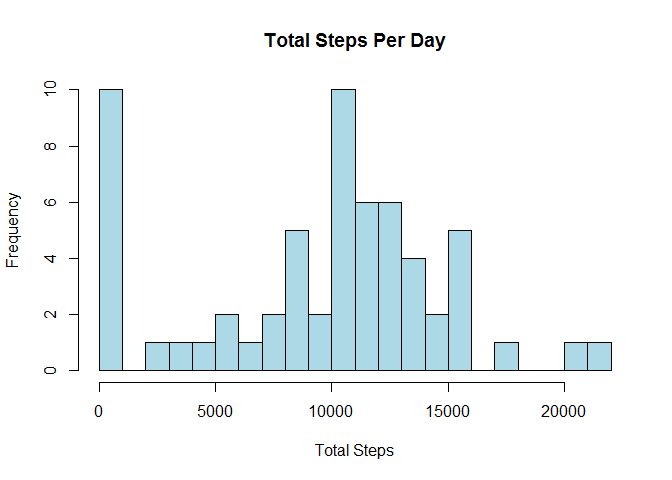
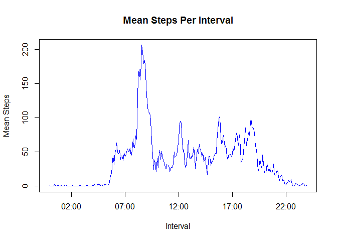
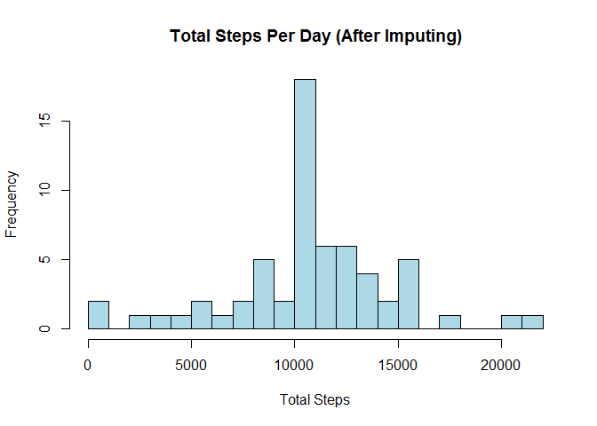
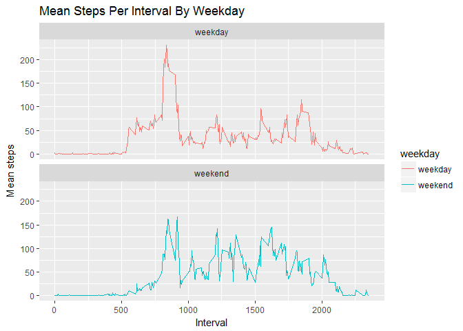

# Reproducible Research: Peer Assessment 1
Created by Hong Xu on 2016/12/29


## Loading and preprocessing the data


```r
unzip("activity.zip")
data <- read.csv("activity.csv", colClasses = c("integer", "Date"))
```
Convert the interval type from integar to POSIXct

```r
data$interval <- sprintf("%04d", data$interval)
data$interval <- as.POSIXct(data$interval, "%H%M",tz="")
```
Display the head of the data

```r
head(data)
```

```
##   steps       date            interval
## 1    NA 2012-10-01 2016-12-29 00:00:00
## 2    NA 2012-10-01 2016-12-29 00:05:00
## 3    NA 2012-10-01 2016-12-29 00:10:00
## 4    NA 2012-10-01 2016-12-29 00:15:00
## 5    NA 2012-10-01 2016-12-29 00:20:00
## 6    NA 2012-10-01 2016-12-29 00:25:00
```

## What is mean total number of steps taken per day?

#### 1. Calculate the total number of steps taken per day

```r
totalStepsPerDay <- with(data, tapply(steps, date, sum, na.rm=T))
```

#### 2. Make a histogram of the total number of steps taken each day

```r
hist(totalStepsPerDay, breaks = 20, main = "Total Steps Per Day", 
     xlab = "Total Steps", ylab = "Frequency", col = "lightblue")
```

<!-- -->

#### 3. Calculate and report the mean and median of the total number of steps taken per day

```r
meanSteps <- mean(totalStepsPerDay)
medianSteps <- median(totalStepsPerDay)
```
Mean and median of total steps per day are 9354.23 steps and 10395 steps

## What is the average daily activity pattern?

#### 1. Make a time series plot of the 5-minute interval and the average number of steps taken, averaged across all days

```r
meanStepsPerInterval <- with(data, tapply(steps, interval, mean, na.rm = T))
intervals <- unique(data$interval)
plot(meanStepsPerInterval ~ intervals, type = "l", col = "blue",
     xlab = "Interval", ylab = "Mean Steps", main = "Mean Steps Per Interval")
```

<!-- -->

#### 2. Which 5-minute interval, on average across all the days in the dataset, contains the maximum number of steps?

```r
maxInterval <- format(intervals[which.max(meanStepsPerInterval)], format = "%H-%M")
maxInterval
```

```
## [1] "08-35"
```

```r
maxMeanSteps <- max(meanStepsPerInterval)
maxMeanSteps
```

```
## [1] 206.1698
```
Interval 08-35 contains the maximum number of steps 206.17

## Imputing missing values

#### 1. Calculate and report the total number of missing values in the dataset

```r
naSum <- sum(is.na(data))
naMean <- mean(is.na(data))
```
A total number of 2304 rows are missing, which is 4.37% of the dataset

#### 2. Devise a strategy for filling in all of the missing values in the dataset.
The strategy is to to fill each missing steps value with the mean for that 5-minute interval

#### 3. Create a new dataset that is equal to the original dataset but with the missing data filled in.

```r
newData <- data
for (i in 1:nrow(newData)) {
    if (is.na(newData$steps[i])) {
        newData$steps[i] <- meanStepsPerInterval[which(newData$interval[i] == intervals)]
    }
}
```
Confirm the new dataset is filled with correct values

```r
head(newData)
```

```
##       steps       date            interval
## 1 1.7169811 2012-10-01 2016-12-29 00:00:00
## 2 0.3396226 2012-10-01 2016-12-29 00:05:00
## 3 0.1320755 2012-10-01 2016-12-29 00:10:00
## 4 0.1509434 2012-10-01 2016-12-29 00:15:00
## 5 0.0754717 2012-10-01 2016-12-29 00:20:00
## 6 2.0943396 2012-10-01 2016-12-29 00:25:00
```

```r
sum(is.na(newData))
```

```
## [1] 0
```

#### 4. Make a histogram of the total number of steps taken each day and Calculate and report the mean and median total number of steps taken per day.

```r
newTotalStepsPerDay <- with(newData, tapply(steps, date, sum, na.rm=T))
hist(newTotalStepsPerDay, breaks = 20, main = "Total Steps Per Day (After Imputing)", 
     xlab = "Total Steps", ylab = "Frequency", col = "lightblue")
```

<!-- -->

```r
newMeanSteps <- mean(newTotalStepsPerDay)
newMeanSteps
```

```
## [1] 10766.19
```

```r
newMedianSteps <- median(newTotalStepsPerDay)
newMedianSteps
```

```
## [1] 10766.19
```
New mean steps 10766.19 and median steps 10766.19 are identical, and they are all larger than their corresponding old values, 9354.23 and 10395. This is because we replace NA values with positive values, resulting in larger total sums.

## Are there differences in activity patterns between weekdays and weekends?

#### 1. Create a new factor variable in the dataset with two levels – “weekday” and “weekend” indicating whether a given date is a weekday or weekend day.

```r
library(lubridate)
```

```
## 
## Attaching package: 'lubridate'
```

```
## The following object is masked from 'package:base':
## 
##     date
```

```r
is_weekday <-function(date){
    if(wday(date)%in%c(1,7)) result<-"weekend"
    else
        result<-"weekday"
    result
}
for (i in 1:nrow(newData)) {
    newData$weekday[i] <- is_weekday(newData$date[i])
}
table(newData$weekday)
```

```
## 
## weekday weekend 
##   12960    4608
```

#### 2. Make a panel plot containing a time series plot of the 5-minute interval and the average number of steps taken, averaged across all weekday days or weekend days

```r
newData$interval <- as.numeric(format(newData$interval, format = "%H%M"))
library(ggplot2)
g <- ggplot(newData, aes(interval, steps, color = weekday))
g + geom_line(stat = "summary", fun.y = "mean") +
    facet_wrap(~weekday,ncol = 1, nrow = 2) +
    xlab("Interval") + ylab("Mean steps") +
    ggtitle("Mean Steps Per Interval By Weekday")
```

<!-- -->
